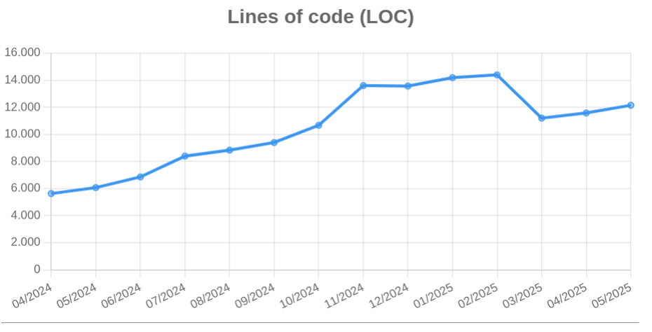
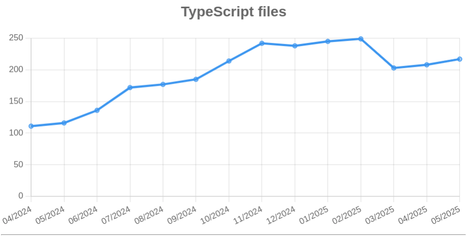
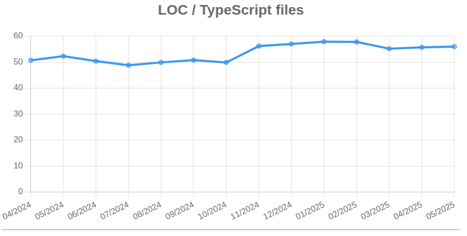

# Explorando evolução de código

Neste exercício, iremos explorar a evolução de código em sistemas reais.

Iremos utilizar a ferramenta [GitEvo](https://github.com/andrehora/gitevo).
Essa ferramenta analisa a evolução de código em repositórios Git nas seguintes linguagens: Python, JavaScript, TypeScript e Java.

Você deve submeter via Moodle apenas o link do seu `fork`, conforme descrito abaixo.

# Passo 1: Selecionar repositório a ser analisado

Selecione um repositório relevante na linguagem de sua preferência (Python, JavaScript, TypeScript ou Java).
Você pode encontrar projetos interessantes nos links abaixo:

- Python: https://github.com/topics/python?l=python
- JavaScript: https://github.com/topics/javascript?l=javascript
- TypeScript: https://github.com/topics/typescript?l=typescript
- Java: https://github.com/topics/java?l=java

# Passo 2: Instalar e rodar a ferramenta GitEvo

Instale a ferramenta [GitEvo](https://github.com/andrehora/gitevo) com o comando:

```
pip install gitevo
```

Rode a ferramenta no repositório selecionado através do seguinte comando (dependendo da linguagem do projeto que escolheu):

```shell
# Python
$ gitevo -r python <git_url>

# JavaScript
$ gitevo -r js <git_url>

# TypeScript
$ gitevo -r ts <git_url>

# Java
$ gitevo -r java <git_url>
```

Onde `<git_url>` é URL do repositório a ser analisado.
Por exemplo, para analisar o projeto Flask escrito em Python:

```
$ gitevo -r python https://github.com/pallets/flask
```

# Passo 3: Explorar os gráficos de evolução de código (`index.html`)

Ao rodar a ferramenta [GitEvo](https://github.com/andrehora/gitevo), o arquivo `index.html` é gerado com diversos gráficos de evolução de código.

Abra o arquivo `index.html` e observe com atenção os gráficos gerados.

# Passo 4: Explicar um gráfico de evolução de código

Selecione um dos gráficos de evolução e explique-o com suas palavras.
Por exemplo, você pode:

- Detalhar a evolução ao longo do tempo, 
- Detalhar se as curvas estão de acordo com boas práticas,
- Explicar grandes alterações nas curvas,
- Explorar a documentação do repositório em busca de explicações para grandes alterações
- Etc.

Seja criativo!

# Exercício

Para responder este exercício, primeiramente, você deve fazer um `fork` deste repositório.
No Moodle, você deve submeter apenas a URL do seu `fork`.

Em seguida, adicione o arquivo gerado `index.html` no seu fork.

Por fim, responda as questões abaixo no seu `fork`: 

1. Repositório selecionado: [Hydra](https://github.com/hydralauncher/hydra)

2. Gráfico selecionado: LOC, TypeScript Files e LOC/Typescript Files
  
3. Explicação:

#### Projeto

Hydra Launcher é um programa de código aberto desenvolvido por brasileiros que serve como um launcher de jogos, permitindo que os utilizadores gerenciem os seus jogos instalados, independentemente da sua origem. É visto como uma alternativa aos launcher tradicionais, como o Steam, e é conhecido por oferecer jogos de forma autossuficiente e sem necessidade de licenças. O projeto é bem recente, começou em 2024, tem alcança um publico grande contanto com mais de 13k de estrelas.

#### Interpretação

Com base nas imagens geradas pelo GitEvo é possível interpretar que o projeto passou por uma fase intensa de crescimento e amadurecimento entre 2024 e 2025.



O gráfico de Lines of Code (LOC) mostra um aumento expressivo de cerca de 6.000 para mais de 12.000 linhas, indicando uma expansão significativa no volume de código. Isso pode estar relacionado à implementação de novas funcionalidades, como suporte a diferente línguas, melhorias na interface do usuário e integração com recursos em nuvem e autenticação.



O gráfico de arquivos TypeScript reforça essa ideia ao apresentar um crescimento de pouco mais de 100 para cerca de 220 arquivos no mesmo período. Isso sugere que, além de novas funcionalidades, houve um esforço para modularizar o sistema, separando responsabilidades em múltiplos arquivos para melhorar a organização e a manutenção do código.



Por fim, o gráfico de LOC por arquivo TypeScript mostra uma leve elevação, o que indica que o aumento de complexidade foi distribuído de forma equilibrada entre os arquivos. Isso é um bom sinal, pois demonstra que os desenvolvedores estão seguindo boas práticas, evitando arquivos excessivamente grandes.

